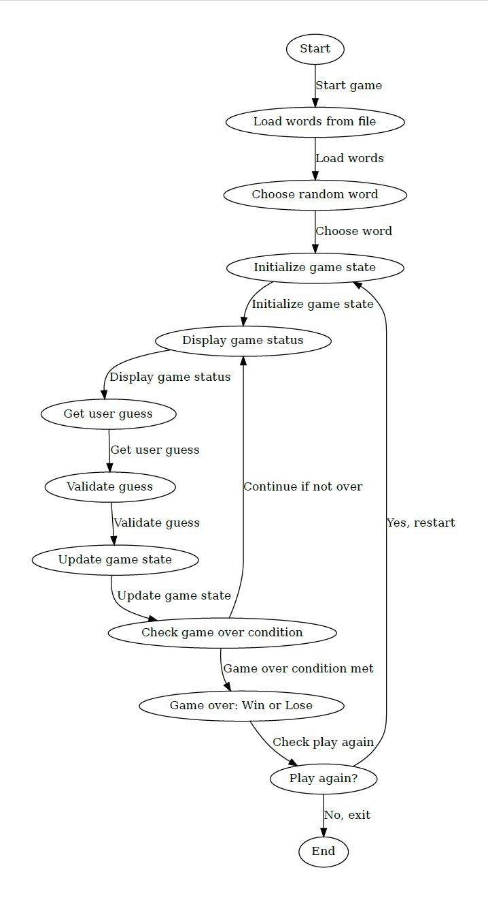
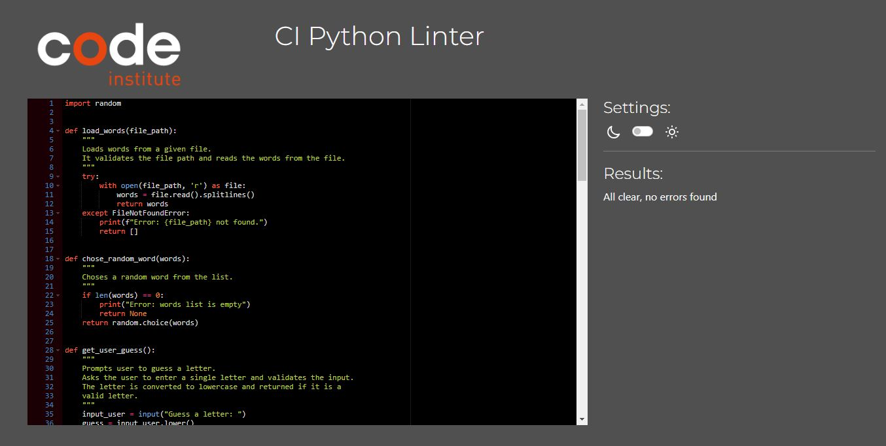

# Hangman Game

[Play Hangman on Heroku](https://your-heroku-app-link.com) | [View Code on GitHub](https://github.com/your-username/hangman-game)

A simple command-line Hangman game implemented in Python. The player guesses letters to figure out a randomly chosen word before they run out of attempts. The game features user-friendly interaction, error handling, and a win/loss message upon completion. This project is aimed at demonstrating basic Python skills such as loops, conditionals, and file handling.


## CONTENTS

- [Hangman Game](#hangman-game)
  - [CONTENTS](#contents)
  - [Introduction](#introduction)
    - [Purpose of the project](#purpose-of-the-project)
  - [User Experience (UX)](#user-experience-ux)
    - [User Stories](#user-stories)
  - [Design](#design)
    - [Game Flow](#game-flow)
    - [Flow Diagram](#flow-diagram)
    - [Features](#features)
      - [Core Features](#core-features)
      - [Future Implementations](#future-implementations)
  - [Technologies Used](#technologies-used)
    - [Languages Used](#languages-used)
    - [Frameworks, Libraries \& Programs Used](#frameworks-libraries--programs-used)
  - [Deployment \& Local Development](#deployment--local-development)
    - [Deployment on Heroku](#deployment-on-heroku)
    - [Local Development](#local-development)
      - [How to Clone](#how-to-clone)
  - [Testing](#testing)
    - [Feature Testing](#feature-testing)
    - [Code Validation](#code-validation)
      - [Python](#python)
    - [Bugs Documentation](#bugs-documentation)
      - [Issue with Guess Validation](#issue-with-guess-validation)
      - [Incorrectly counting guessed letters](#incorrectly-counting-guessed-letters)
    - [Solved Bugs](#solved-bugs)
    - [Known Bugs](#known-bugs)
  - [Credits](#credits)
    - [Code Used](#code-used)
    - [Acknowledgments](#acknowledgments)

## Introduction

### Purpose of the project

The purpose of this project is to build a simple command-line game of Hangman in Python, where a user attempts to guess a word one letter at a time. The game provides feedback on each guess, tracks the number of incorrect guesses, and ends when the player either successfully guesses the word or runs out of attempts.

This project showcases basic programming constructs such as loops, conditionals, functions, and error handling in Python.

## User Experience (UX)

### User Stories

- As a user, I want to start a game and have a randomly chosen word to guess.
- As a user, I want feedback on each guess to see if I’m correct or incorrect.
- As a user, I want to know how many incorrect guesses I have remaining.
- As a user, I want the game to end and display whether I won or lost.
- As a user, I want the option to play again once the game ends.

## Design

### Game Flow

The game starts by loading a list of words from a file. A word is randomly chosen, and the user is prompted to guess letters. Each correct guess reveals the positions of the letter in the word, while each incorrect guess reduces the number of remaining attempts. The game ends when the word is fully guessed or the player runs out of attempts.

### Flow Diagram

The following flow diagram provides a visual representation of the game's flow:




### Features

#### Core Features

- **Random Word Selection:** A random word is chosen from a list in `words.txt`.
- **Guessing Letters:** Users can input letters one by one to try and guess the word.
- **Feedback on Guesses:** Correct letters are revealed, and incorrect guesses are tracked.
- **Endgame Messages:** The game displays a win or loss message when the game ends.
- **Replay Option:** After the game ends, the user is given the option to play again.

#### Future Implementations

- Add difficulty levels with different word lengths and numbers of attempts.
- Implement ASCII art for the hangman to visually represent incorrect guesses.
- Add categories for words (e.g., animals, countries) to choose from before starting the game.

## Technologies Used

### Languages Used

- **Python 3.** The entire project is written in Python using basic programming constructs such as loops, functions, and conditionals.

### Frameworks, Libraries & Programs Used

- **Python's `random` module:** To randomly select a word from the list.
- **Python’s built-in `open()` function:** To read the words from the `words.txt` file.
- **Heroku:** For deploying the command-line game to the cloud.
- **Command Line Interface (CLI):** The game runs directly in the terminal/command prompt.

## Deployment & Local Development

### Deployment on Heroku

1. Push your code to a GitHub repository if it's not already there.

2. In Heroku, create a new app and link it to your GitHub repository.

3. When you create the app, you will need to add two buildpacks from the **Settings** tab. The ordering is as follows:
   
    - `heroku/python`
    - `heroku/nodejs`

4. You must then create a **Config Var** called `PORT`. Set this to `8000`.

5. Navigate to the "Deploy" tab and enable automatic deploys from your repository or manually deploy your branch.

6. Once deployed, you can run the game by navigating to the Heroku app's logs or command-line interface.


### Local Development

#### How to Clone

To clone the repository and run the game locally:

1.  Log in to GitHub.
2.  Go to the repository containing the Hangman game.
3.  Click on the Code button and copy the link (HTTPS or SSH).
4.  Open your terminal and run the following command:

    ```bash
    git clone https://github.com/galindo89/hangman-pgz.git
    ```
    You can also view the repository on GitHub [here](https://github.com/galindo89/hangman-pgz).


5.  Navigate to the project folder and run the Python file:

    ```bash
    cd hangman-pgz
    python run.py
    ```

You will also need to have a file called `words.txt` in the same directory, containing a list of words (one per line) for the game to use.

## Testing
### Feature Testing

| Feature                      | Test Description                                        | Input                  | Expected Output                                           | Status   |
|------------------------------|--------------------------------------------------------|------------------------|-----------------------------------------------------------|----------|
| Single letter validation      | Ensure only single letter inputs are accepted           | Enter multiple letters | Error message, prompt for single-letter input              | Passed   |
| Letter input validation       | Ensure only alphabetic letters are accepted as guesses  | Enter a number or symbol | Error message, prompt for a valid alphabetic letter        | Passed   |
| Repeated guess handling       | Ensure repeated guesses do not count against the user   | Guess same letter twice| Second guess does not decrement remaining attempts         | Passed   |
| Word with repeated letters    | Ensure words with repeated letters handle correctly     | Guess letter "o" for "book" | Both "o"s revealed in the word                             | Passed   |
| Play again prompt validation  | Ensure correct input validation for play again prompt   | Enter "yes", "y", any other input      | Accepts yes" or "y" to continue, any other input ends the game                | Passed   |

### Code Validation
#### Python
Python code validation was conducted using [PEP8CI](https://pep8ci.herokuapp.com/#) to ensure that the code adheres to Python's PEP8 style guide and best practices.

| File Tested    | Errors                                             | Solutions Applied                                        | Screenshot of Clear Validator Output                        |
| -------------- | -------------------------------------------------- | -------------------------------------------------------  | ----------------------------------------------------------- |
| `run.py`   | None                                                | Code passed with no major warnings or errors             |  |


### Bugs Documentation

During the development of the game, a few bugs were identified:

#### Issue with Guess Validation

Initially, the program allowed multi-character inputs. This was fixed by adding input validation to ensure only single letters are accepted.

#### Incorrectly counting guessed letters

The game did not properly count repeated guesses, allowing incorrect guesses to affect the remaining attempts. This was fixed by checking if a letter had already been guessed before applying any changes to the game state.

### Solved Bugs

- Fixed multi-character input: Added validation to restrict input to single alphabetic characters.
- Fixed issue with repeated guesses: Updated the game logic to ensure repeated guesses (both correct and incorrect) do not affect the remaining attempts.
- Fixed bug with input validation when asking if the user wants to play again.
- Fixed issue where words containing multiple occurrences of the same letter were not validated correctly.

### Known Bugs

-   No current known bugs.

## Credits

### Code Used

This project was developed entirely by the author, with inspiration drawn from various Python tutorials and documentation.

### Acknowledgments

-   Thanks to the Python community for their extensive documentation and examples.
-   Special thanks to my mentors for guiding me through the development process.
